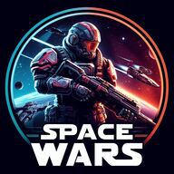

# Space Wars 🌌

Space Wars is an exhilarating third-person shooter that catapults players into the heart of a futuristic intergalactic conflict. As an elite soldier, you'll engage in epic ground battles and thrilling spaceship combat while navigating a high-stakes rivalry between two powerful factions, both vying for supremacy and control over the vast expanse of the galaxy.

## 🎮 How to play?

Download the game build from the [latest release](https://github.com/jakub-galazka/spacewars/releases/latest).

## References

The game draws ideas and solutions from a series of tutorials prepared by [Gorka Games](https://www.youtube.com/@GorkaGames) and [CodeLikeMe](https://www.youtube.com/@CodeLikeMe).

All graphics not listed below were generated by the [DALL-E 3](https://www.bing.com/images/create) model available in the [Bing](https://www.bing.com) browser.

### Characters

* [Sci-Fi Character 08 (Renegade)](https://www.unrealengine.com/marketplace/en-US/product/sci-fi-character-08-renegade)

* [Alien Soldier](https://www.mixamo.com)

### Animations

* [Animation Starter Pack](https://www.unrealengine.com/marketplace/en-US/product/animation-starter-pack)

* [Firing Rifle, Rifle Aiming Idle, Walk With Rifle](https://www.mixamo.com)

### Weapons

* [Futuristic Weapon Concept High-Poly-Version Free 3D model](https://www.cgtrader.com/free-3d-models/military/gun/futuristic-weapon-concept-high-poly-version)

* [Automatic Sci-Fi Rifle Free 3D model](https://www.cgtrader.com/free-3d-models/military/gun/automatic-sci-fi-rifle)

### Environments

* [Spaceship Interior Environment Set](https://www.unrealengine.com/marketplace/en-US/product/spaceship-interior-environment-set)

* [Polar Sci-Fi Facility](https://www.unrealengine.com/marketplace/en-US/product/polar-sci-fi-facility)

### SFXs

* [Epic Hybrid Logo](https://pixabay.com/sound-effects/epic-hybrid-logo-157092/)

* [The Glorious Army - Cinematic Epic Battle Music (Warhammer inspired)](https://pixabay.com/music/main-title-the-glorious-army-cinematic-epic-battle-music-warhammer-inspired-155892/)

* [typewriter.wav](https://freesound.org/people/Horn/sounds/9744/)

* [Dark Souls ' You Died ' Sound Effect - Meme Sound Effect Button for Soundboard](https://tuna.voicemod.net/sound/d23c1e88-eb51-448e-8ad1-9abde6e2cad7)

* [mission complete 2.0.mp3](https://freesound.org/people/halomaniac/sounds/57364/)

* [footstep-concrete.wav](https://freesound.org/people/swuing/sounds/38873/)

* [Heartbeat, Regular, Single, 01-01, LOOP.wav](https://freesound.org/people/InspectorJ/sounds/485076/)

* [blaster shot single 5.wav](https://freesound.org/people/MikeE63/sounds/466867/)

* [steam_burst.wav](https://freesound.org/people/pengo_au/sounds/90143/)

* [Sword Hit](https://pixabay.com/pl/sound-effects/sword-hit-7160/)

* [Deep Space Ship Effect](https://freesound.org/people/hykenfreak/sounds/214663/)

### Icons

* [Assault Rifle](https://www.flaticon.com/free-icon/assault-rifle_7445133)

* [Down Arrow](https://www.flaticon.com/free-icon/down-arrow_318426?k=1705423402867)

* [Enemy](https://www.flaticon.com/free-icon/enemy_1477230)

### Others

* [Range Target](https://www.youtube.com/watch?v=3OCisqQMaVc&t=80s)
